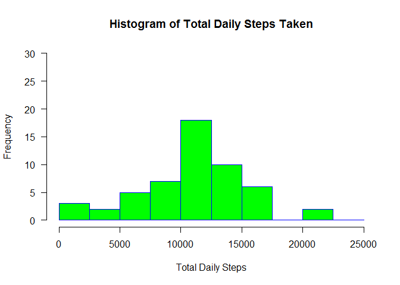

## Loading and preprocessing the data
The read below assumes that the working directory contains the data file called "activity.csv".


```r
mydata <- read.csv("activity.csv")
```

## What is mean total number of steps taken per day?

```r
dailysteps <- aggregate(mydata$steps, by = list(mydata$date), FUN = sum)
colnames(dailysteps) <- c("date", "stepsum")
hist(dailysteps$stepsum,
     main="Histogram of Total Daily Steps Taken",
     xlab="Total Daily Steps",
     border="blue",
     col="green",
     las = 1,
     breaks = seq(0, 25000, 2500),
     ylim = c(0,30),
     xlim = c(0,25000))
```

<!-- -->

```r
meansteps <- mean(dailysteps$stepsum, na.rm = TRUE)
mediansteps <- median(dailysteps$stepsum, na.rm = TRUE)
```

The mean number of daily steps taken is **10766.19** and the median is **10765**.

## What is the average daily activity pattern?

```r
intervalmeans <- mydata %>%
  as_tibble() %>%
  group_by(interval) %>%
  summarise_at(vars(steps), funs(mean(., na.rm=TRUE)))
plot(intervalmeans$interval,
     intervalmeans$steps,
     type= "l",
     xlab= "5-minute interval",
     ylab= "Average number of steps taken",
     col= "green",
     lwd=2)
```

<!-- -->

```r
maxstepinterval <- intervalmeans$interval[which.max(intervalmeans$steps)]
```

Interval 835 contains the maximum average number of steps taken.

## Imputing missing values

```r
missingvaluesum <- sum(is.na(mydata))
#Replace all missing values with that day's average
impdata <- mydata
for (row in 1:nrow(impdata)){
  if (is.na(impdata$steps[row])) {
    impdata$steps[row] <- intervalmeans$steps[which(intervalmeans$interval == impdata$interval[row])]
  }
}
impdailysteps <- aggregate(impdata$steps, by = list(impdata$date), FUN = sum)
colnames(impdailysteps) <- c("date", "stepsum")
hist(impdailysteps$stepsum,
     main="Histogram of Total Daily Steps Taken (with imputed data)",
     xlab="Total Daily Steps",
     border="blue",
     col="green",
     las = 1,
     breaks = seq(0, 25000, 2500),
     ylim = c(0,30),
     xlim = c(0,25000))
```

<!-- -->

```r
impmeansteps <- mean(impdailysteps$stepsum)
impmediansteps <- median(impdailysteps$stepsum)
```

The total number of missing values in the dataset is 2304.

The mean number of daily steps taken using imputed data is **10766.19** and the median is **10766.1886792**.

By imputing missing data, the mean number of daily steps has remained the same and the median has slightly increased. The frequency of total daily steps taken between 10000 and 12500 has also increased significantly.

## Are there differences in activity patterns between weekdays and weekends?

```r
impdata <- impdata %>%
  as_tibble() %>%
  mutate(daytype = ifelse(weekdays(ymd(date), abbreviate = TRUE) %in% c("Sat","Sun"), "weekend", "weekday"))
```

```
## Warning: package 'bindrcpp' was built under R version 3.4.4
```

```r
impdata$daytype <- as.factor(impdata$daytype)

impintervalmeans <- with(impdata, aggregate(steps, by = list(daytype, interval), FUN = mean))
colnames(impintervalmeans) <- c("daytype", "interval", "meansteps")

ggplot(impintervalmeans, aes(interval, meansteps)) +
  geom_line() +
  facet_grid(daytype ~ .) +
  ylab("Number of Mean Steps per Interval") +
  xlab("5-min Interval")
```

<!-- -->
